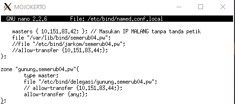

# Jarkom_Modul2_Lapres_B04
**Setting utama server dan client**

#### 1. Website utama dengan alamat http://semerub04.pw

#### 2. Alias http://www.semerub04.pw

#### 3. Subdomain http://penanjakan.semeruyyy.pw yang diatur DNS-nya pada MALANG dan mengarah ke IP Server PROBOLINGGO 

#### 4. reverse domain untuk domain utama

#### 5. subdomain dengan alamat http://gunung.semeruyyy.pw yang didelegasikan pada server MOJOKERTO dan mengarah ke IP Server PROBOLINGGO.

#### 6. subdomain dengan nama http://naik.gunung.semeruyyy.pw, domain ini diarahkan ke IP Server PROBOLINGGO.

#### 7. Domain http://semeruyyy.pw memiliki DocumentRoot pada /var/www/semeruyyy.pw. Awalnya web dapat diakses menggunakan alamat http://semeruyyy.pw/index.php/home.

#### 8. diaktifkan mod rewrite agar urlnya menjadi http://semeruyyy.pw/home.

#### 9. Web http://penanjakan.semeruyyy.pw akan digunakan untuk menyimpan assets file yang memiliki DocumentRoot pada /var/www/penanjakan.semeruyyy.pw dan memiliki struktur folder sebagai berikut: 

/var/www/penanjakan.semeruyyy.pw

/public/javascripts

/public/css

/public/images

/errors

#### 10. Pada folder /public dibolehkan directory listing namun untuk folder yang berada di dalamnya tidak dibolehkan. (12) Untuk mengatasi HTTP Error code 404, disediakan file 404.html pada folder /errors untuk mengganti error default 404 dari Apache.

#### 11. Untuk mengakses file assets javascript awalnya harus menggunakan url http://penanjakan.semeruyyy.pw/public/javascripts. Karena terlalu panjang maka dibuatkan konfigurasi virtual host agar ketika mengakses file assets menjadi http://penanjakan.semeruyyy.pw/js.

#### 12. sedangkan web http://naik.gunung.semeruyyy.pw sudah bisa diakses hanya dengan menggunakan port 8888. DocumentRoot web berada pada /var/www/naik.gunung.semeruyyy.pw.

#### 13. web http://naik.gunung.semeruyyy.pw agar diberi autentikasi password dengan username “semeru” dan password “kuynaikgunung” supaya aman dan tidak sembarang orang bisa mengaksesnya.

#### 14. setiap Bibah mengunjungi IP PROBOLINGGO akan dialihkan secara otomatis ke http://semeruyyy.pw.

#### 15. Karena pengunjung pada /var/www/penanjakan.semeruyyy.pw/public/images sangat banyak maka semua request gambar yang memiliki substring “semeru” akan diarahkan menuju semeru.jpg.
