# Jarkom_Modul2_Lapres_B04
**Setting utama server dan client**

Untuk setting utama, kita memiliki 2 switch, 1 router SURABAYA, kemudian 2 client SIDOARJO dan GRESIK, lalu 3 server yaitu MALANG, MOJOKERTO, dan probolinggo. Untuk setting topologinya adalah sebagai berikut :

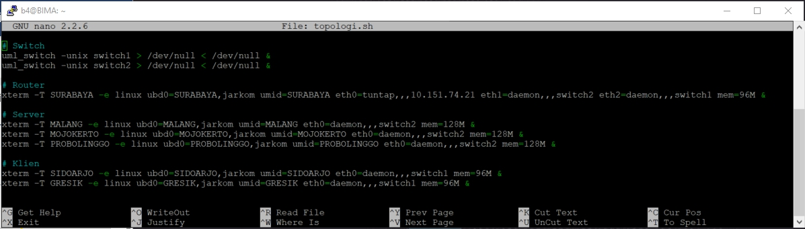

#### 1. Website utama dengan alamat http://semerub04.pw
pada uml malang kita ketik command berikut
```
nano /etc/bind/named.conf.local
```
lalu akan memunculkan isi dari file tersebut kemudian kita buat zone semerub04.pw seperti gambar berikut

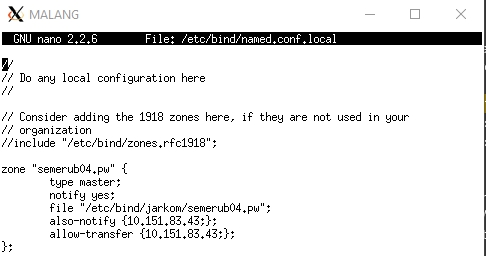

kemudian buat folder jarkom dengan perintah
```
mkdir /etc/bind/jarkom
```
lalu file db.local pada path **/etc/bind** kedalam folder jarkom yang sudah dibuat tadi dan namanya dirubah menjadi semerub04.pw
```
cp /etc/bind/db.local /etc/bind/jarkom/semerub04.pw
```
kemudian pada file semerub04.pw diedit menjadi seperti berikut :

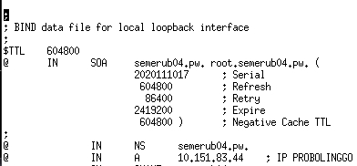

#### 2. Alias http://www.semerub04.pw
Untuk menambahkan alias, kita perlu membuat record CNAME pada file semerub04.pw pada /etc/bind/jarkom seperti berikut :

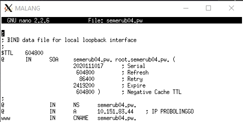

#### 3. Subdomain http://penanjakan.semeruyyy.pw yang diatur DNS-nya pada MALANG dan mengarah ke IP Server PROBOLINGGO 
Untuk menambahkan subdomain, kita perlu membuat record A dengan nama penanjakan di kolom pertama dan ip tujuan disini kita menggunakan ip PROBOLINGGO pada kolom keempat pada file semerub04.pw pada /etc/bind/jarkom seperti berikut :

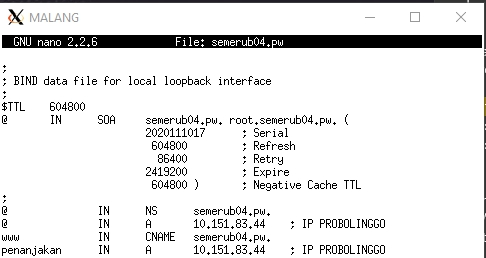

#### 4. reverse domain untuk domain utama
Untuk melakukan reverse domain utama (semerub04.pw) kita buka named.conf.local pada malang lalu ditambahkan perintah seperti berikut :

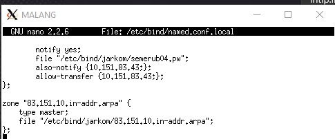

setelah membuat config diatas selanjutnya kita buat file dengan nama reverse ip malang yaitu 83.151.10.in-adrr.arpa yang berasal dari copy db.local ke folder jarkom. Lalu file tersebut diedit seperti berikut:

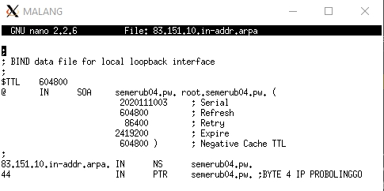

#### 5. (5) DNS Server Slave pada MOJOKERTO 

Untuk membuat master slave  kita buat config pada file named.conf.local pada uml MALANG sebagai master dengan menambahkan type lalu ditambah also-notify dan allow-transfer pada ip MOJOKERTO sebagai slave, confignya seperti berikut :

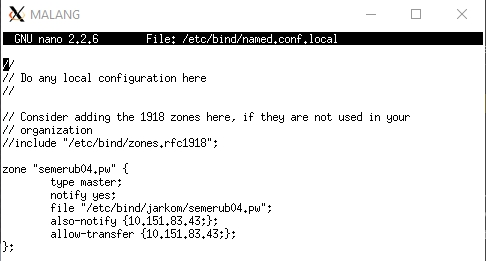

lalu pada named.conf.local pada uml MOJOKERTO dibuat type slave dengan konfigurasi seperti berikut :

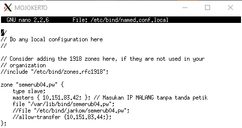

Setelah itu kita comment nameserver malang pada salah satu client (GRESIK)

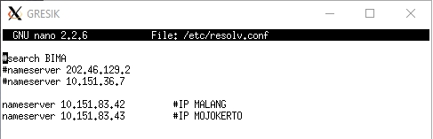

Kemudian dilakukan ping, outputnya seperti berikut :

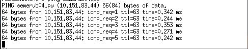

### 6. subdomain dengan alamat http://gunung.semeruyyy.pw yang didelegasikan pada server MOJOKERTO dan mengarah ke IP Server PROBOLINGGO.

Pertama kita buat ns1 dengan tipe A mengarah ke IP MOJOKERTO sebagai tujuan kemudian dibuat subdomain gunung lali diberi nilai tujuan ns1, confignya sebagai berikut:

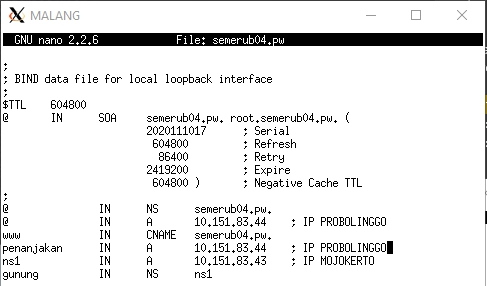

kemudian kita comment dnssec-validation auto dan ditambahkan allow-query pada named.conf.options pada malang, confignya sebagai berikut :

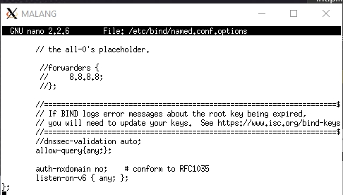

Lalu pada named.conf.local MALANGT dibuat seperti berikut :

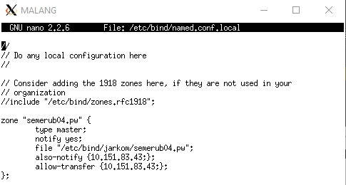

Kemudian pada MOJOKERTO juga comment dnssec-validation auto; dan tambahkan baris berikut pada /etc/bind/named.conf.options, kemudian kita setting named.conf.local seperti berikut

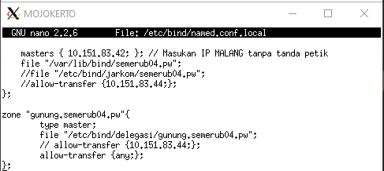

kemudian kita buat folder delegasi pada /etc/bind/ dan mengkopi db.local dengan nama subdomain yaitu gunung.semerub04.pw seperti berikut

```
mkdir /etc/bind/delegasi
cp /etc/bind/db.local /etc/bind/delegasi/its.jarkom2020.com
```
Lalu edit filenya seperti berikut :

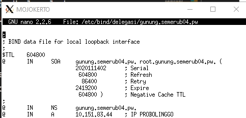

dan dilakukan ping sebagai berikut :

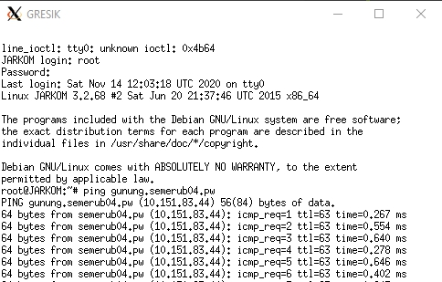

#### 7. subdomain dengan nama http://naik.gunung.semeruyyy.pw, domain ini diarahkan ke IP Server PROBOLINGGO.

Pada /etc/bind/delegasi/its.jarkom2020.com kita buat seperti berikut :

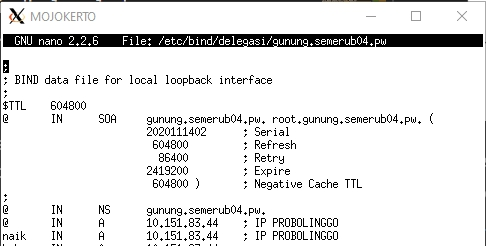

#### 8. Domain http://semeruyyy.pw memiliki DocumentRoot pada /var/www/semeruyyy.pw. Awalnya web dapat diakses menggunakan alamat http://semeruyyy.pw/index.php/home.

pada folder /etc/apache2/sites-available kita buat file bernama semerub04.pw yang merupakan hasil kopi dari file default pada folder tersebut, kemudian kita config sebagai berikut :


pada DocumentRoot kita arahkan ke /var/www/semerub04.pw yang akan dibuat nanti, folder ini berisi file yang didownload dari 10.151.36.202/semeru.pw.zip. Setelah kita membuat folder semerub04.pw dan diisi file tersebut maka kita bisa langsung mengakses alamat semerub04.pw dan hasilnya seperti berikut :

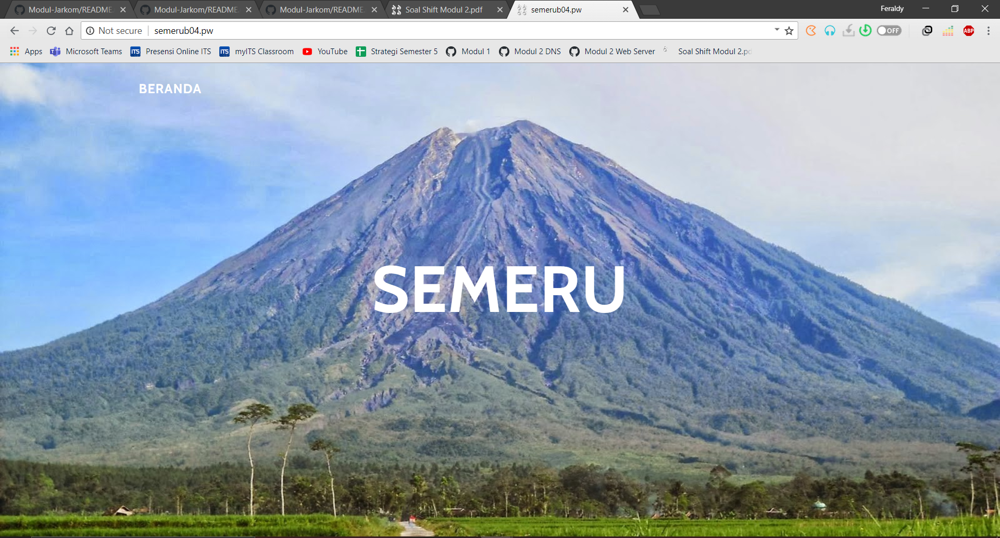

#### 9. diaktifkan mod rewrite agar urlnya menjadi http://semeruyyy.pw/home.

Pada soal ini dibuat file .htaccess pada folder semerub04.pw di /var/www sebelumnya dan kita config seperti berikut :

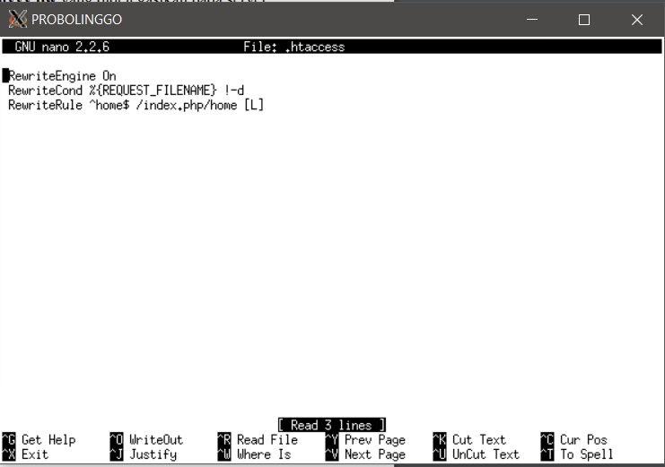

dimana kita rewrite nama /index.php/home menjadi home, sehingga hasilnya seperti dua gambar dibawah :

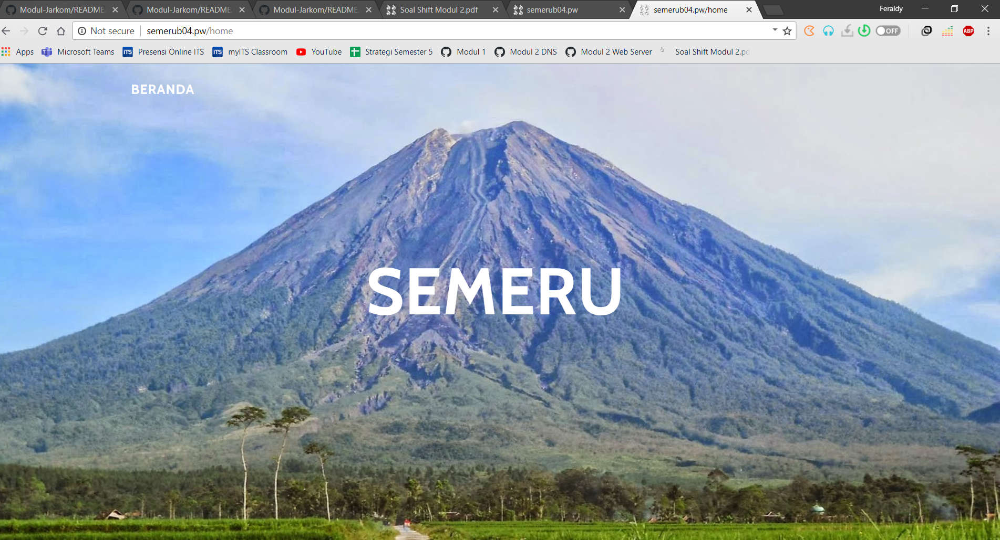


#### 10. Web http://penanjakan.semeruyyy.pw akan digunakan untuk menyimpan assets file yang memiliki DocumentRoot pada /var/www/penanjakan.semeruyyy.pw dan memiliki struktur folder sebagai berikut: 

/var/www/penanjakan.semeruyyy.pw

/public/javascripts

/public/css

/public/images

/errors

Untuk membuat directory listing, pertama-tama pada konfigurasi web penanjakan.semerub04.pw yang berada di direktori /etc/apache2/sites-available kita arahkah root dari web 
ke direktori /var/www/penanjakan.semerub04.pw. Selanjutnya kita tambahkan 

<Directory /var/www/penanjakan.semerub04.pw>
     Options +Indexes
 </Directory>

Dengan menambah opsi +Indexes maka dihasilkan tampilan directory listing

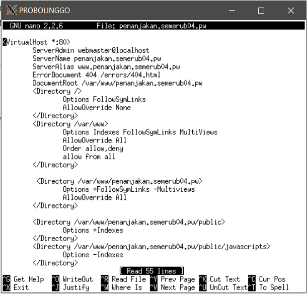

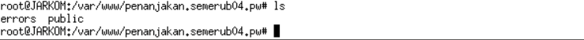

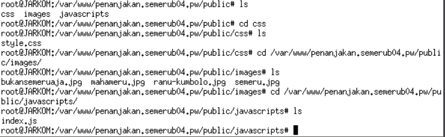

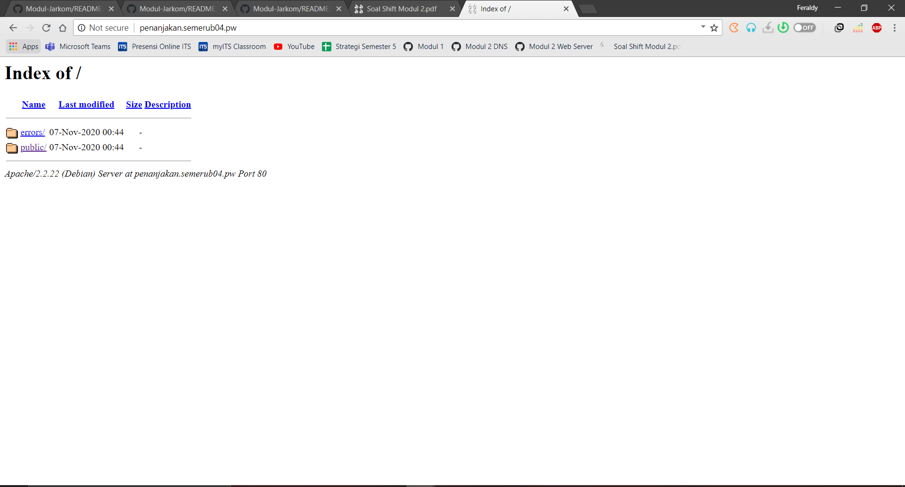

#### 11. Pada folder /public dibolehkan directory listing namun untuk folder yang berada di dalamnya tidak dibolehkan.

Untuk soal no 11, karna folder didalam direktori public tidak diperbolahkan directory listing, maka pada konfigruasi web
kita  tambahkan 

Option -Indexes

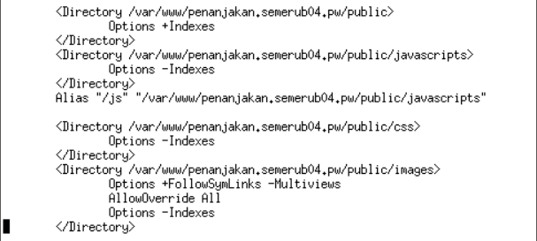

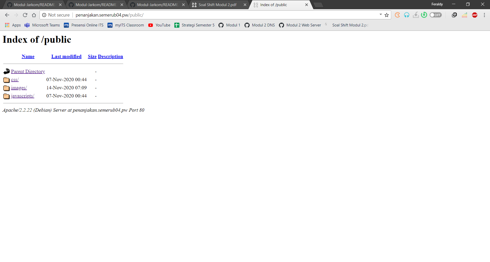


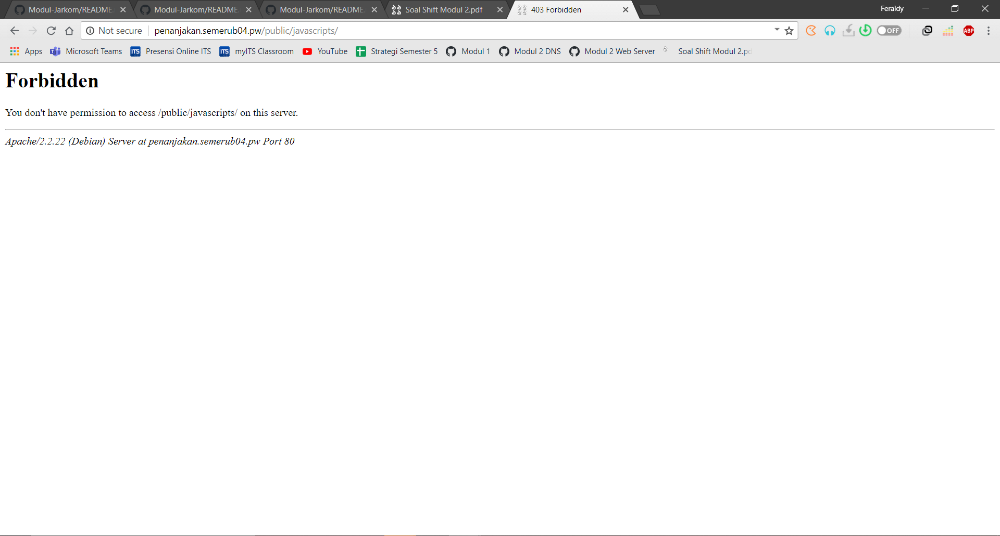


#### 12. Untuk mengatasi HTTP Error code 404, disediakan file 404.html pada folder /errors untuk mengganti error default 404 dari Apache.

Pada soal ini kita tambahkan 
```
ErrorDocument 404 /errors/404.html
```

pada file penanjakan.semerub04.pw dimana ketika url akan diarahkan ke halaman 404.html pada folder error pada folder penanjakan.semerub04.pw


Outputnya akan seperti berikut :

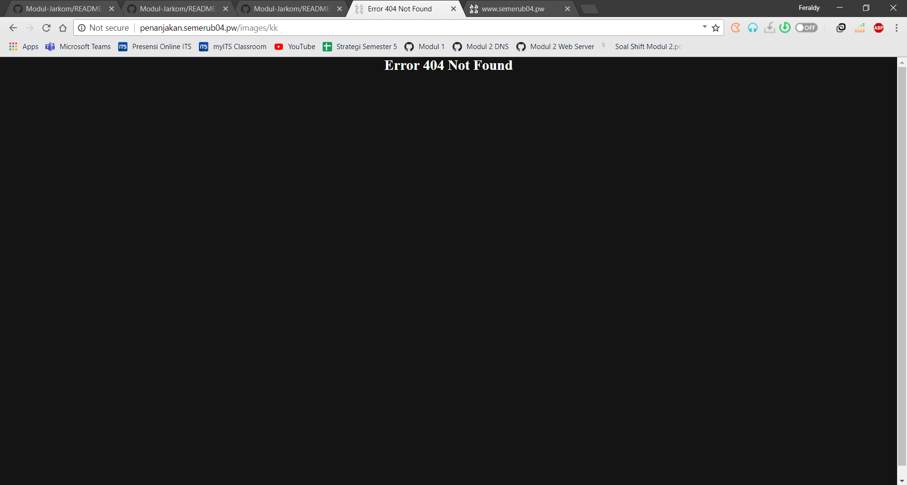

#### 13. Untuk mengakses file assets javascript awalnya harus menggunakan url http://penanjakan.semeruyyy.pw/public/javascripts. Karena terlalu panjang maka dibuatkan konfigurasi virtual host agar ketika mengakses file assets menjadi http://penanjakan.semeruyyy.pw/js.

Pada soal ini dibuat alias pada file penanjakan.semerub04.pw dengan konfigurasi seperti berikut :

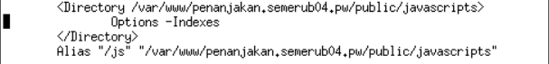

Maka hasilnya akan seperti berikut :

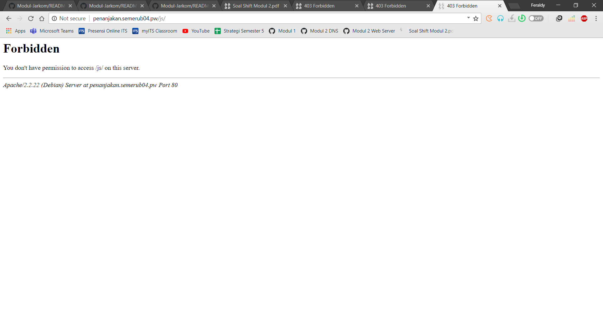

#### 14. sedangkan web http://naik.gunung.semeruyyy.pw sudah bisa diakses hanya dengan menggunakan port 8888. DocumentRoot web berada pada /var/www/naik.gunung.semeruyyy.pw.

Untuk soal ini kita cukup mengganti 8080 pada virtual host file naik.gunung.semerub04.pw dengan 8888 kemudian ditambahkan listen 8888 pada file /etc/apache2/ports.conf, konfigurasinya akan seperti berikut :

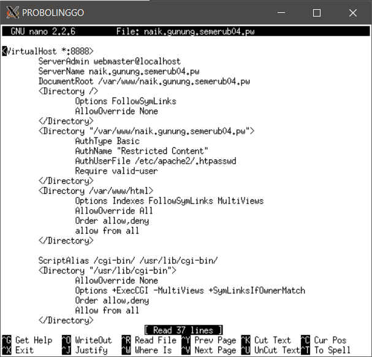

<!-- TODO -->

#### 15. web http://naik.gunung.semeruyyy.pw agar diberi autentikasi password dengan username “semeru” dan password “kuynaikgunung” supaya aman dan tidak sembarang orang bisa mengaksesnya.

<!-- TODO -->

Pada soal ini kita buat file .htpasswd didalam folder naik.gunung.semerub04.pw lalu dibuat config .htaccess sebagai berikut

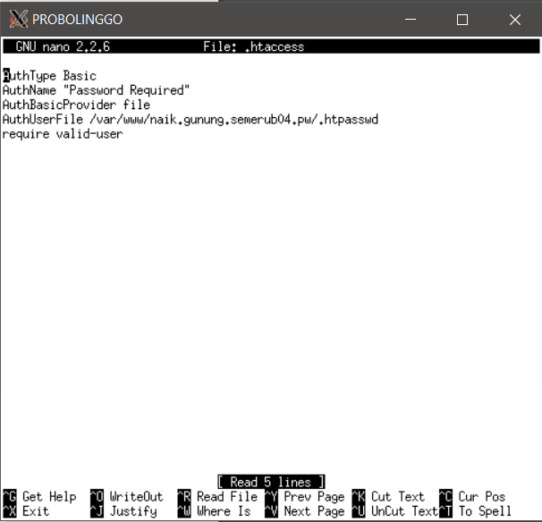

Kemudian outputnya akan seperti berikut :

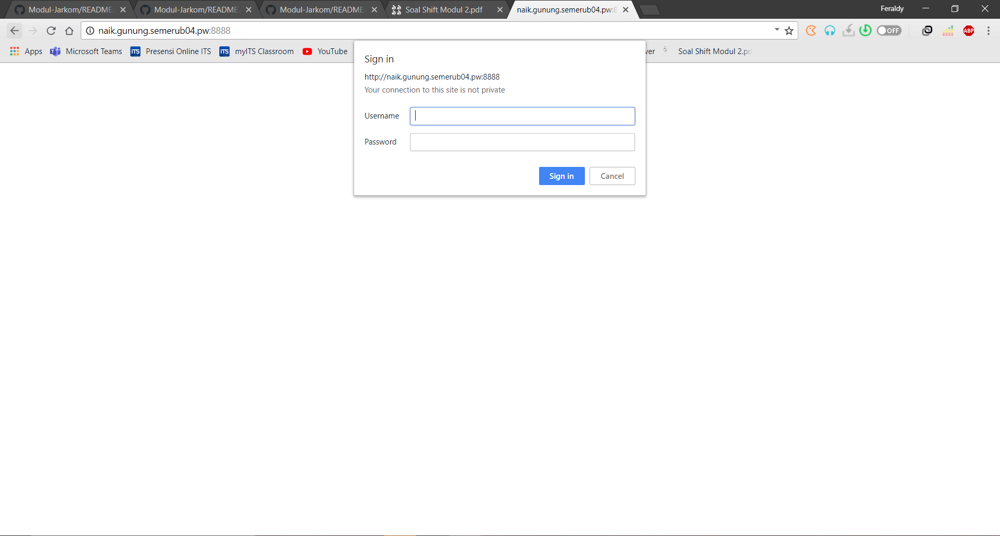

#### 16. setiap Bibah mengunjungi IP PROBOLINGGO akan dialihkan secara otomatis ke http://semeruyyy.pw.

Pada soal ini kita cukup menambahkan 
```
Redirect / http://www.semerub04.pw 
```

pada file default dan default-ssl pada folder /etc/apache2/sites-available

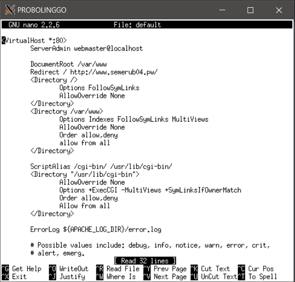

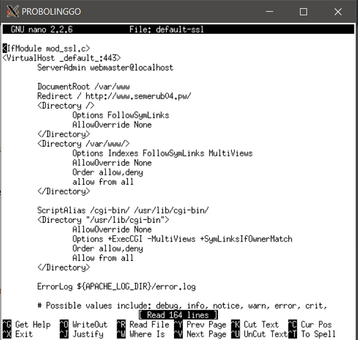

Outputnya akan seperti berikut

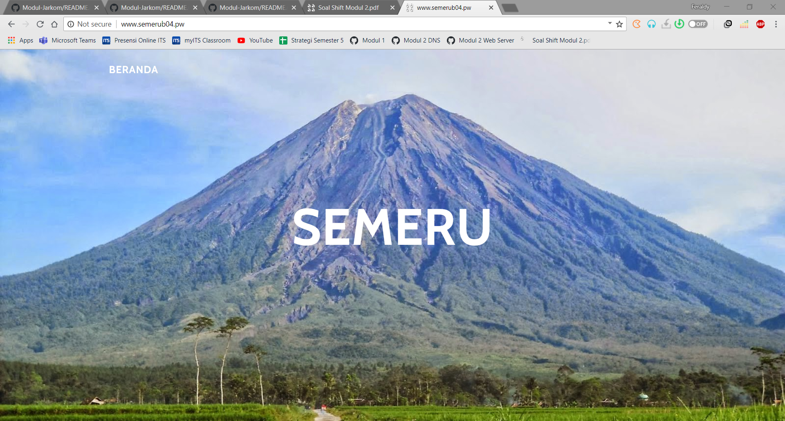

#### 17. Karena pengunjung pada /var/www/penanjakan.semeruyyy.pw/public/images sangat banyak maka semua request gambar yang memiliki substring “semeru” akan diarahkan menuju semeru.jpg.
